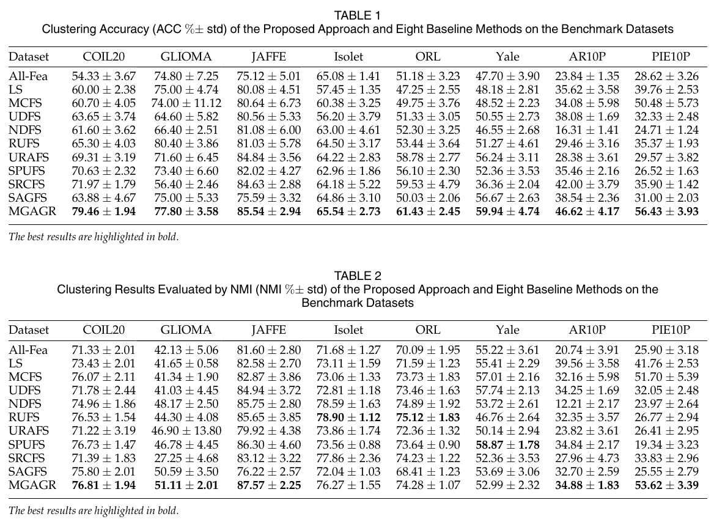

# MGAGR

MATLAB implementation of **Robust Unsupervised Feature Selection via Multi-Group Adaptive Graph Representation**.

MGAGR introduces a multi-group adaptive graph representation for unsupervised feature selection. It divides features into multiple groups, builds local similarity matrices for those groups, reconstructs a global similarity matrix with adaptive group weights, and learns a self-representation matrix for feature ranking.

## Paper

- **Title:** Robust Unsupervised Feature Selection via Multi-Group Adaptive Graph Representation
- **Authors:** Mengbo You, Aihong Yuan, Min Zou, Dongjian He, and Xuelong Li
- **Journal:** IEEE Transactions on Knowledge and Data Engineering, vol. 35, no. 3, pp. 3030-3044, 2023
- **DOI:** [10.1109/TKDE.2021.3124255](https://doi.org/10.1109/TKDE.2021.3124255)
- **IEEE Xplore:** [document 9606609](https://ieeexplore.ieee.org/document/9606609/)
- **Original paper code link:** <https://github.com/misteru/MGAGR>

## Repository Contents

- `MGAGR.m` - core MATLAB function for MGAGR optimization and feature ranking.
- `docs/mgagr-results-tables.png` - cropped screenshot of the MGAGR paper's main ACC/NMI result tables.
- `README.md` - project description, usage notes, results summary, and citation.

## Requirements

- MATLAB.
- Input data matrix `X` should be arranged as `n x d`, where `n` is the number of samples and `d` is the number of features.
- `group_label` should assign each feature to one of `group_num` feature groups.
- Normalize or scale data appropriately before running the algorithm. The graph construction steps are sensitive to feature scale and the chosen kernel parameter `sigma`.

The repository contains the core MGAGR implementation only; benchmark datasets and experiment scripts are not included.

## Usage

```matlab
% X: n-by-d data matrix, with samples stored as rows
% group_label: d-by-1 or 1-by-d vector assigning each feature to a group
alpha = 1;
gamma = 1;
sigma = 1;
maxIter = 20;
group_num = max(group_label);

[index, Z, S, W, obj] = MGAGR(X, alpha, gamma, sigma, group_num, group_label, maxIter);

num_features = 100;
selected_feature_index = index(1:num_features);
X_selected = X(:, selected_feature_index);
```

### Function Signature

```matlab
[index, Z, S, W, obj] = MGAGR(X, alpha, gamma, sigma, group_num, group_label, maxIter)
```

| Argument | Description |
| --- | --- |
| `X` | `n x d` data matrix; each row is one sample and each column is one feature. |
| `alpha`, `gamma`, `sigma` | Model hyperparameters described in the paper. |
| `group_num` | Number of feature groups. |
| `group_label` | Length-`d` vector of feature group labels, using labels from `1` to `group_num`. |
| `maxIter` | Maximum number of outer optimization iterations. |

| Output | Description |
| --- | --- |
| `index` | Feature indices sorted by descending score. |
| `Z` | `d x d` feature self-representation matrix. |
| `S` | `n x n` learned global similarity matrix. |
| `W` | `group_num x n` adaptive group-weight matrix. |
| `obj` | Objective values across iterations. |

## Experimental Results

The MGAGR paper evaluates selected features by running K-means and reports clustering accuracy (ACC) and normalized mutual information (NMI) on eight benchmark datasets. The following values are the MGAGR rows from Tables 1 and 2 of the TKDE paper. Larger values are better.



| Dataset | ACC (% +/- std) | NMI (% +/- std) |
| --- | ---: | ---: |
| COIL20 | 79.46 +/- 1.94 | 76.81 +/- 1.94 |
| GLIOMA | 77.80 +/- 3.58 | 51.11 +/- 2.01 |
| JAFFE | 85.54 +/- 2.94 | 87.57 +/- 2.25 |
| Isolet | 65.54 +/- 2.73 | 76.27 +/- 1.55 |
| ORL | 61.43 +/- 2.45 | 74.28 +/- 1.07 |
| Yale | 59.94 +/- 4.74 | 52.99 +/- 2.32 |
| AR10P | 46.62 +/- 4.17 | 34.88 +/- 1.83 |
| PIE10P | 56.43 +/- 3.93 | 53.62 +/- 3.39 |

The paper reports that MGAGR performs consistently better than the compared state-of-the-art UFS methods in terms of ACC, with especially large gains on COIL20, AR10P, and PIE10P. In terms of NMI, MGAGR reports the best results on COIL20, GLIOMA, JAFFE, AR10P, and PIE10P.

## Citation

Please cite the paper if this code is useful for your research:

```bibtex
@ARTICLE{9606609,
  author={You, Mengbo and Yuan, Aihong and Zou, Min and He, Dongjian and Li, Xuelong},
  journal={IEEE Transactions on Knowledge and Data Engineering},
  title={Robust Unsupervised Feature Selection via Multi-Group Adaptive Graph Representation},
  year={2023},
  volume={35},
  number={3},
  pages={3030-3044},
  doi={10.1109/TKDE.2021.3124255}
}
```
