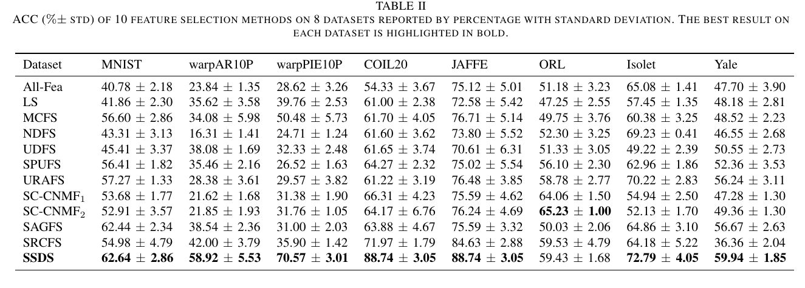
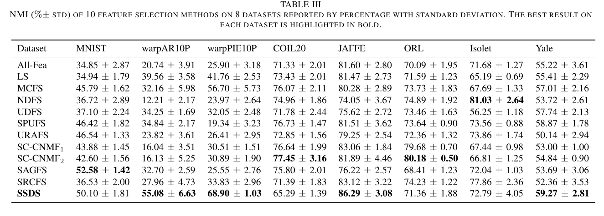

# SSDS

MATLAB implementation and experiment resources for **Symmetrical Self-Representation and Data-Grouping Strategy for Unsupervised Feature Selection**.

SSDS is an unsupervised feature selection method that combines a symmetrical self-representation structure with a data-grouping strategy. It builds local similarity matrices from feature groups, adaptively reconstructs a global similarity matrix, and ranks features from the learned projection matrix.

## Paper

- **Title:** Symmetrical Self-Representation and Data-Grouping Strategy for Unsupervised Feature Selection
- **Authors:** Aihong Yuan, Mengbo You, Yuhan Wang, Xun Li, and Xuelong Li
- **Journal:** IEEE Transactions on Knowledge and Data Engineering, vol. 36, no. 12, pp. 9348-9360, 2024
- **DOI:** [10.1109/TKDE.2024.3437364](https://doi.org/10.1109/TKDE.2024.3437364)
- **IEEE Xplore:** [document 10621643](https://ieeexplore.ieee.org/document/10621643/)
- **Original paper code link:** <https://github.com/misteru/SSDS>

## Repository Contents

- `SSDS.m` - core MATLAB function for SSDS optimization and feature ranking.
- `StepsToReproduce.mlx` - MATLAB Live Script for reproducing experiments and parameter searches.
- `FIG_curves_various_number_of_features/` - 22 MATLAB `.fig` files for ACC/NMI curves under different selected-feature counts.
- `MAT_CSV_classification_results_of_our_method_SSDS/` - zipped MATLAB and CSV classification-result files.
- `MAT_CSV_clustering_results_of_our_method_SSDS/` - zipped MATLAB and CSV clustering-result files, plus a clustering ACC p-value CSV.
- `docs/ssds-acc-table.png` - cropped screenshot of the paper's main ACC comparison table.
- `docs/ssds-nmi-table.png` - cropped screenshot of the paper's main NMI comparison table.
- `README.md` - project description, usage notes, results summary, and citation.

## Requirements

- MATLAB.
- A `gpi.m` implementation on the MATLAB path. `SSDS.m` calls `gpi` when updating the pseudo-label matrix.
- Input data matrix `X` should be arranged as `d x n`, where `d` is the number of features and `n` is the number of samples.
- Benchmark datasets should be downloaded separately. The reproduction script refers to datasets available from the [scikit-feature dataset collection](https://jundongl.github.io/scikit-feature/datasets.html).

The repository includes SSDS code and result artifacts, but benchmark datasets are not included.

## Usage

```matlab
% X: d-by-n data matrix, with samples stored as columns
% c: number of clusters/classes expected in the data
c = 10;
alpha = 0.5;
beta = 1;
gamma = 1;
NITER = 20;
group_num = 8;
sigma = 1;

[Z, score, index] = SSDS(X, c, alpha, beta, gamma, NITER, group_num, sigma);

num_features = 100;
selected_feature_index = index(1:num_features);
X_selected = X(selected_feature_index, :);
```

### Function Signature

```matlab
[Z, score, index] = SSDS(X, c, alpha, beta, gamma, NITER, group_num, sigma)
```

| Argument | Description |
| --- | --- |
| `X` | `d x n` data matrix; each column is one sample. |
| `c` | Desired cluster number. |
| `alpha`, `beta`, `gamma`, `sigma` | Model hyperparameters described in the paper and implementation. |
| `NITER` | Maximum number of optimization iterations. |
| `group_num` | Number of feature groups used to construct local similarity matrices. |

| Output | Description |
| --- | --- |
| `Z` | `d x c` projection matrix used for feature ranking. |
| `score` | Feature score vector computed from `Z`. |
| `index` | Feature indices sorted by descending score. |

## Reproducing Experiments

`StepsToReproduce.mlx` contains the experiment workflow and parameter-search logic used with the provided result files.

1. Put `StepsToReproduce.mlx` in the MATLAB working directory.
2. Download the required `.mat` datasets and place them under `./datasets/`.
3. Update the dataset filenames in the `datalist` variable if your local filenames differ.
4. Adjust parameter ranges if needed. The main parameters are `alpha`, `beta`, `gamma`, `sigma`, and `group_num`.
5. Run the live script in MATLAB. The script tests the predefined parameter ranges and reports the resulting feature-selection performance.

## Experimental Results

The paper evaluates selected features mainly with K-means clustering, using clustering accuracy (ACC) and normalized mutual information (NMI). The main comparison tables report SSDS against baseline UFS methods on eight datasets. Larger values are better.





The SSDS rows from Tables II and III are summarized below.

| Dataset | ACC (% +/- std) | NMI (% +/- std) |
| --- | ---: | ---: |
| MNIST | 62.64 +/- 2.86 | 50.10 +/- 1.81 |
| warpAR10P | 58.92 +/- 5.53 | 55.08 +/- 6.63 |
| warpPIE10P | 70.57 +/- 3.01 | 68.90 +/- 1.03 |
| COIL20 | 88.74 +/- 3.05 | 65.29 +/- 1.39 |
| JAFFE | 88.74 +/- 3.05 | 86.29 +/- 3.08 |
| ORL | 59.43 +/- 1.68 | 71.36 +/- 1.88 |
| Isolet | 72.79 +/- 4.05 | 72.79 +/- 4.05 |
| Yale | 59.94 +/- 1.85 | 59.27 +/- 2.81 |

The paper reports that SSDS obtains the best ACC on all listed datasets except ORL and obtains the best NMI on five datasets. Additional `.fig`, `.mat`, and `.csv` artifacts in this directory can be reused to compare new methods against SSDS.

## Citation

Please cite the paper if this code is useful for your research:

```bibtex
@ARTICLE{10621643,
  author={Yuan, Aihong and You, Mengbo and Wang, Yuhan and Li, Xun and Li, Xuelong},
  journal={IEEE Transactions on Knowledge and Data Engineering},
  title={Symmetrical Self-Representation and Data-Grouping Strategy for Unsupervised Feature Selection},
  year={2024},
  volume={36},
  number={12},
  pages={9348-9360},
  doi={10.1109/TKDE.2024.3437364}
}
```
